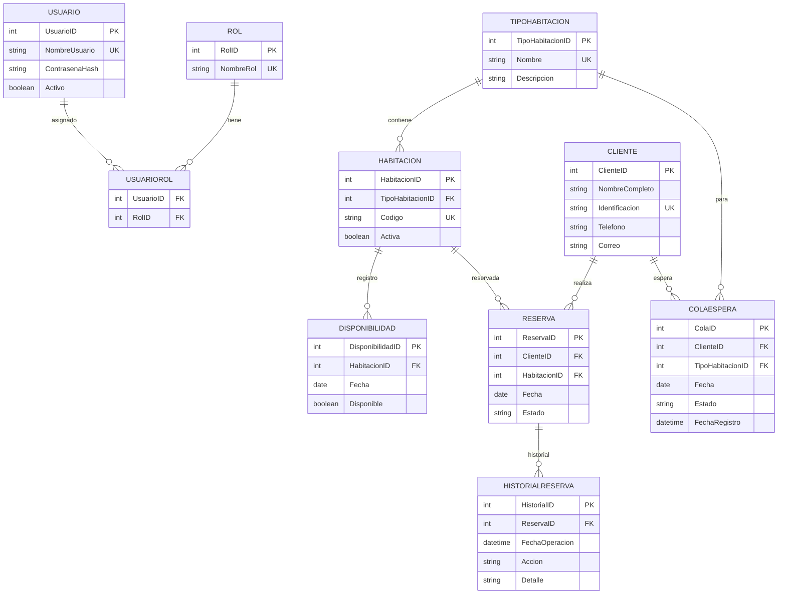

# Base de Datos HotelMasCarga - Diagrama ER

```mermaid
---
config:
    ER:
        layoutDirection: LR
---
erDiagram
    USUARIO ||--o{ USUARIOROL : asignado
    ROL ||--o{ USUARIOROL : tiene
    
    TIPOHABITACION ||--o{ HABITACION : contiene
    TIPOHABITACION ||--o{ COLAESPERA : para
    
    HABITACION ||--o{ DISPONIBILIDAD : registro
    HABITACION ||--o{ RESERVA : reservada
    
    CLIENTE ||--o{ RESERVA : realiza
    CLIENTE ||--o{ COLAESPERA : espera
    
    RESERVA ||--o{ HISTORIALRESERVA : historial

    USUARIO {
        int UsuarioID PK
        string NombreUsuario UK
        string ContrasenaHash
        boolean Activo
    }

    USUARIOROL {
        int UsuarioID FK
        int RolID FK
    }

    ROL {
        int RolID PK
        string NombreRol UK
    }

    TIPOHABITACION {
        int TipoHabitacionID PK
        string Nombre UK
        string Descripcion
    }

    HABITACION {
        int HabitacionID PK
        int TipoHabitacionID FK
        string Codigo UK
        boolean Activa
    }

    CLIENTE {
        int ClienteID PK
        string NombreCompleto
        string Identificacion UK
        string Telefono
        string Correo
    }

    DISPONIBILIDAD {
        int DisponibilidadID PK
        int HabitacionID FK
        date Fecha
        boolean Disponible
    }

    RESERVA {
        int ReservaID PK
        int ClienteID FK
        int HabitacionID FK
        date Fecha
        string Estado
    }

    HISTORIALRESERVA {
        int HistorialID PK
        int ReservaID FK
        datetime FechaOperacion
        string Accion
        string Detalle
    }

    COLAESPERA {
        int ColaID PK
        int ClienteID FK
        int TipoHabitacionID FK
        date Fecha
        string Estado
        datetime FechaRegistro
    }
```
